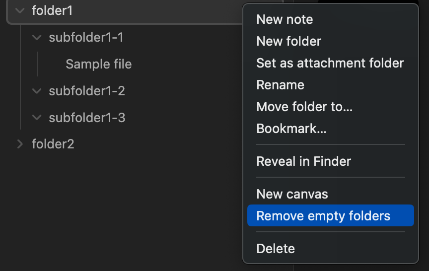

# Remove Empty Folders

This is an Obsidian plugin that removes empty folders.

## Caution !!

**Be sure to back up Obisidan data before running this plugin !!**

**In the worst case scenario, data may be lost.**

## How to use

Select the notes you want to merge in the file explorer.

Select the folder(s) in the File Explorer from which you want to remove the empty folder(s).

Right click on the selection and select `Remove empty folders`.

In the image example, `subfulder1-2` and `subfulder1-3` will be removed.

## Limitations

This plugin removes empty folders at the point of execution. Therefore, empty folders as a result of running the plugin will not be removed.

You may need to run the plugin several times to remove all empty folders.

## Troubleshootings

In the unlikely event that an unexpected folder is deleted, please check inside the `ObsidianValtPath/.trash` folder.

The plugin moves the empty folder to the obsidian `.trash` folder rather than physically removing it, so the contents can be checked and recovered as shown in the following image.

